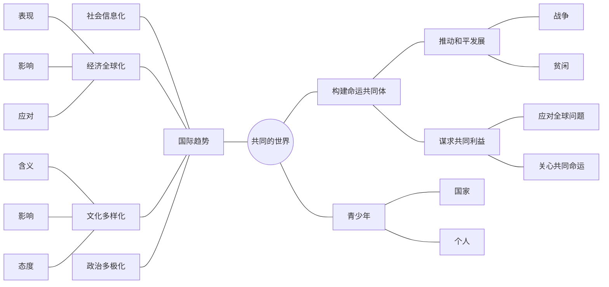

```mermaid
graph LR

#root((共同的世界))
1[国际趋势]
1.1[社会信息化]
1.2[经济全球化]
1.2.1[表现]
1.2.2[影响]
1.2.3[应对]
1.3[文化多样化]
1.3.1[含义]
1.3.2[影响]
1.3.3[态度]
1.4[政治多极化]
2[构建命运共同体]
2.1[推动和平发展]
2.1.1[战争]
2.1.2[贫闲]
2.2[谋求共同利益]
2.2.1[应对全球问题]
2.2.2[关心共同命运]
3[青少年]
3.1[国家]
3.2[个人]

1 --- #root
1.1 --- 1
1.2 --- 1
1.3 --- 1
1.4 --- 1
1.2.1 --- 1.2
1.2.2 --- 1.2
1.2.3 --- 1.2
1.3.1 --- 1.3
1.3.2 --- 1.3
1.3.3 --- 1.3

#root --- 2
2 --- 2.1
2 --- 2.2
2.1 --- 2.1.1
2.1 --- 2.1.2
2.2 --- 2.2.1
2.2 --- 2.2.2

#root --- 3
3 --- 3.1
3 --- 3.2
```

```mermaid
flowchart LR
    c1-->a2
    subgraph 1
    a1-->a2
    end
    subgraph 2
    b1-->b2---b3
    end
    subgraph 3
    c1-->c2
    subgraph 4
    d-->d
    
    end
```

