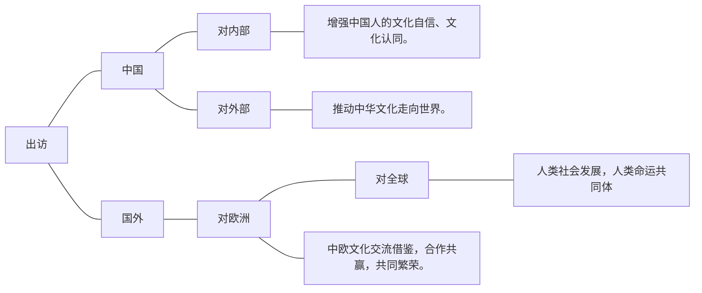

# 2　相关考点梳理

## 2.3 意义类题目答题模板 （国际事件的意义）

### 答题逻辑（步骤可省略）

1. 事件对中国的影响。
    对内：增强文化自信和国家认同感等。
    对外：增强中国的国际影响力和国际地位。
    综合：树立一个和平合作负责任的大国形象。
2. 事件本身发挥的作用（即对涉及国家的影响）
3. 事件对参与方的作用（对国家间交往互动、合作共赢）
4. 事件对全世界全人类（和平与发展、经济全球化、人类命运共同体等）

### 例题

从文化的角度，分析下习主席出访欧洲三国的意义。

参考答案：
  1. 有利于更好推动中华文化走向世界，提升中华文化的影响力；增加文化的认同和文化自信。
  2. 有利于推动中欧文化交流互鉴，合作共赢、共同繁荣。
  3. 有利于推动人类文明的进步，建设开放包容的人类命运共同体。