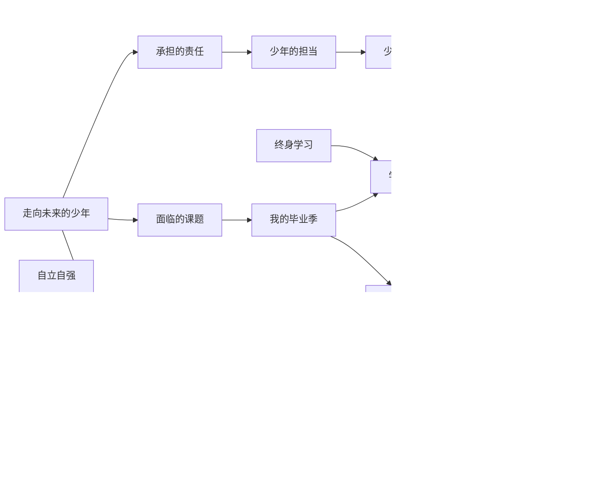

```mermaid
graph LR

#root[走向未来的少年]
1[承担的责任]
1.[少年的担当]
1..[少年当自强]
.1..[自立自强]
1..1[少年强  中国强]
1..2[青少年的情怀与抱负]
2[面临的课题]
2.[我的毕业季]
.2.1[终身学习]
2.1[学无止境]
2.1.1[积极面对当下的学习]
2.1.2[在实践中学习]
.2.2[爱岗敬业]
2.2[多彩的职业]
2.2.1[职业准备]
2.2.2[敬业精神]
3[走向未来]
3.[从这里出发]
3..[走问未来]
.3..[未来]
3..1[畅想未来]
3..2[踏上新征程]

#root --> 1 --> 1. --> 1.. --> 1..1
1.. --> 1..2

.2.1 --> 2.1
#root --> 2 --> 2. --> 2.1 --> 2.1.1
2.1 --> 2.1.2
2. --> 2.2 --> 2.2.1
.2.2 --> 2.2 --> 2.2.2

#root --> 3 --> 3. --> 3.. --> 3..1
.3.. --> 3..
3.. --> 3..2
```